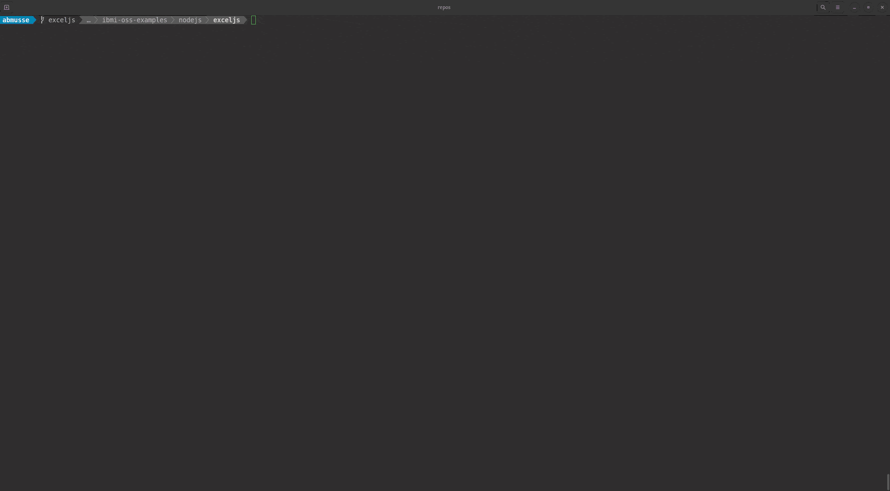

# ExcelJS Example

Node.js application that creates an Excel worksheet
with data from Db2 for i table.

## Prerequisites

- Install Node.js

    On IBM i this can be installed via yum from an SSH terminal with:

    ```bash
    $ yum install nodejs14
    ```

- Install ODBC driver and required dependencies.

    Refer to the [odbc setup guide](https://github.com/IBM/ibmi-oss-examples/blob/master/odbc/odbc.md#odbc) for platform specific instrctions.

## Getting Started

1) Clone this project and change directory into `ibmi-oss-example/nodejs/exceljs`

    ```bash
    git clone https://github.com/IBM/ibmi-oss-examples.git

    cd ibmi-oss-examples/nodejs/exceljs
    ```

2) Install dependencies

   ```bash
   $ npm install
   ```

3) Configure `DB_HOST`, `DB_USER`, and `DB_PASS` enviorment variables within the [.env](.env) file. Or configure `DB_DSN` environment variable to use a [DSN](https://github.com/IBM/ibmi-oss-examples/blob/master/odbc/odbc.md#dsns) to connect.

4) Run the app
   
   ```bash
   npm start
   ```


